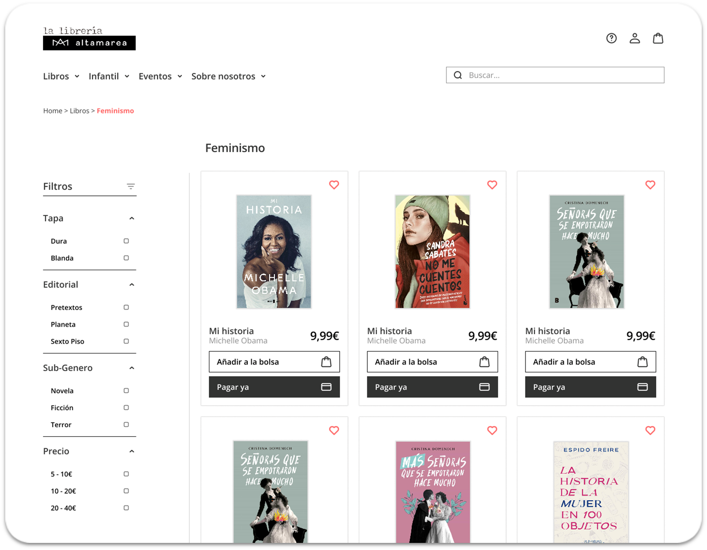

# Proyecto_CRO. Mejora de la web de e-commerce.

### Descripción del proyecto
El objetivo principal fue mejorar la experiencia de compra en la página web de la librería y reducir el número de clicks necesarios para realizar una compra.
Se realizaron extracciones de datos mediante la experiencia de usuarios y pruebas de compra ficticia en ambas versiones de la página web.

### Extracción de datos
En la primera extracción de datos, se contabilizaron el número de clicks y el tiempo que los usuarios tardaban en completar una compra sugerida de un libro específico.
Estos datos proporcionaron información sobre la eficiencia y usabilidad de la página web original.

### Colaboración con el departamento de UX/UI
Se mantuvieron reuniones con el departamento de UX/UI para compartir los resultados de la primera extracción de datos y sugerir mejoras en la página web.

En conjunto, se decidió realizar cambios en el estilo de los filtros y realizar ajustes visuales para agilizar el proceso de compra.
Segunda extracción de datos
Se realizó una segunda extracción de datos utilizando la página web con los cambios implementados por el departamento de UX/UI.
Esta extracción permitió comparar los resultados obtenidos antes y después de los cambios realizados en la página web.

### A/B Testing y conclusiones

Utilizando Python, se aplicó el teorema de Bayes para realizar un análisis de A/B Testing.
Basándonos en los datos recopilados, se llegó a las siguientes conclusiones:

Aunque la media de clicks en el primer test era 18. El minimo lo establecimos en 13 clicks y conseguimos reducirlo a 10 

La media de tiempo en el primer test era de 1:30 y conseguimos reducirlo a 50 segundos.

En resumen, este proyecto de A/B Testing demostró que los cambios realizados en la página web de la librería, en colaboración con el departamento de UX/UI, tuvieron un impacto positivo en la experiencia de compra. Se logró reducir significativamente el número de clicks necesarios y el tiempo de compra. Estos resultados respaldan la eficacia de las mejoras implementadas y proporcionan una base sólida para futuras optimizaciones en la página web.

